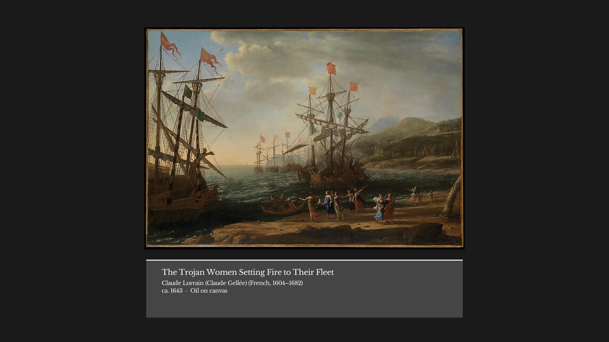
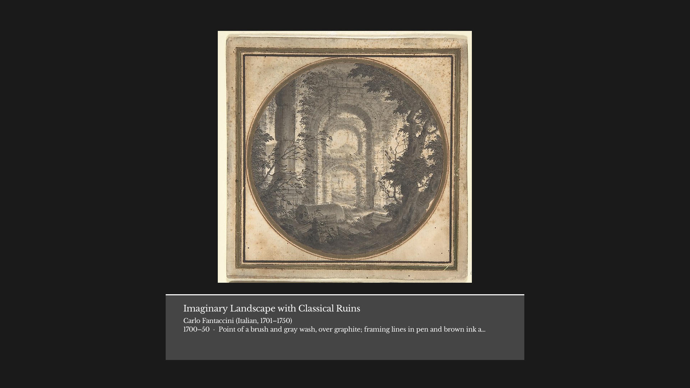
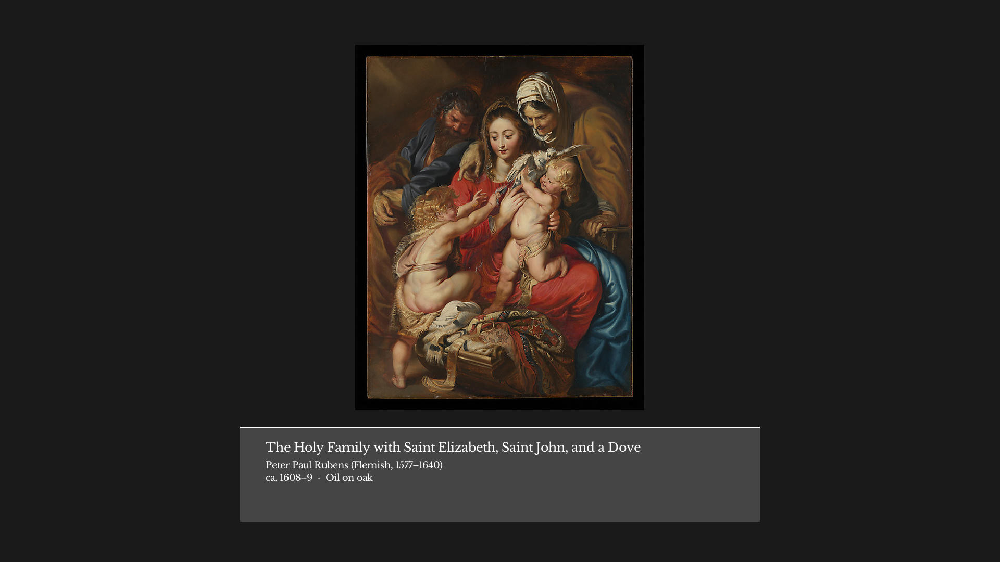
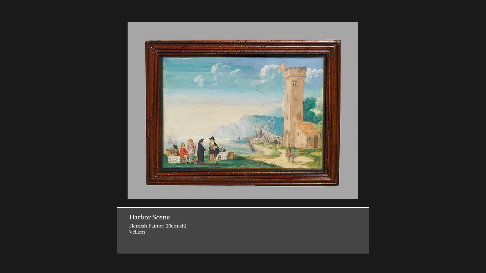

# 🏛️ artgg

**Turn your desktop into a curated museum.**

<table>
  <tr>
    <td></td>
    <td></td>
  </tr>
  <tr>
    <td></td>
    <td></td>
  </tr>
</table>

`artgg` (Art Gallery Generator) is a cross-platform TUI that fetches classical masterpieces and transforms them into high-resolution desktop wallpapers, complete with elegant, museum-style placards.

## ✨ Features

- **🖼️ Curated Feeds:** Filter by museum department. More options to come.
- **🎓 Educational Placards:** Every wallpaper includes a rendered placard featuring the artwork title, date, and artist.
- **⚡ Zero Overhead:** Powered by a local SQLite database and generates images on demand. No background daemons or memory-hogging processes.
- **🛠️ Zero Config:** Works out of the box with sensible defaults.

## 🚀 Installation

### Shell Install

**macOS / Linux:**

```shell
curl --proto '=https' --tlsv1.2 -LsSf https://github.com/ncale/artgg/releases/download/v0.1.0/artgg-installer.sh | sh
```

**Windows (PowerShell):**

```powershell
powershell -ExecutionPolicy Bypass -c "irm https://github.com/ncale/artgg/releases/download/v0.1.0/artgg-installer.ps1 | iex"
```

## ⌨️ Usage

Simply run the executable to launch the interface:

```shell
artgg
```

---

Built with Rust and MIT licensed.
